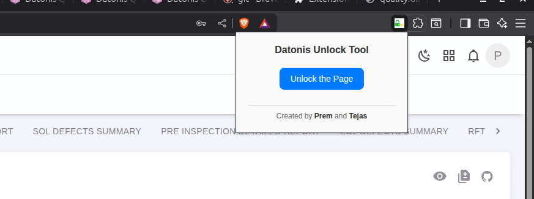

# 🔓 Datonis Unlock Tool - Chrome Extension
It's really not cool to keep your pages or functions locked, so this tool is here to help you unlock them—just with a single click!


## 📸 Preview

>   
> _Popup with unlock button_

---

## 🛠️ Installation

1. **Clone or Download** this repository:
    ```bash
    git clone https://github.com/Prem07a/LockOut.git
    ```

2. **Open Chrome** and go to: `chrome://extensions`

3. Enable **Developer Mode** (top right)

4. Click **Load Unpacked** and select the project folder

5. The extension icon will appear in your toolbar. Click it on a supported Datonis page to run it.

---


## 📌 Notes

* Make sure you're logged in, as the extension relies on your session cookies.
* This does **not** store any data or require special permissions beyond the domain.


## 🙌 Acknowledgements

Built with ❤️ to simplify working with the Datonis platform.

Author:
<a href="https://github.com/Prem07a"> Prem</a> & <a href="https://github.com/tejasSanap"> Tejas</a>
---


